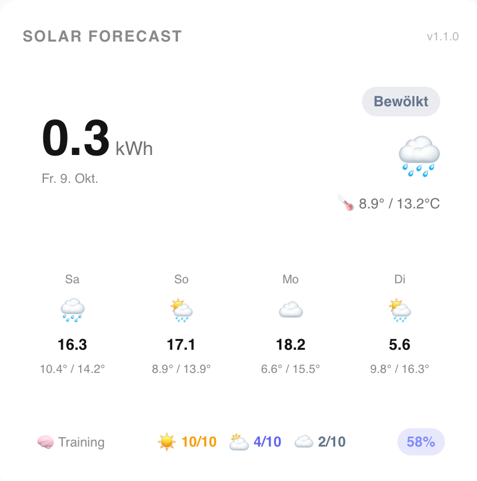

# Solar Forecast – Solar Yield Forecasting for Home Assistant

A HACS-compatible custom integration that predicts your daily solar panel energy production using a self-learning ML model trained automatically from your Home Assistant Energy Dashboard data — with a built-in Lovelace card, no separate frontend install required.

📖 Blog post (German): [PV-Prognose in Home Assistant mit Solar Forecast](https://itrend24.de/pv-prognose-home-assistant-solar-forecast/)



## Features

- **Solar yield forecast** (kWh per day, up to 8 days ahead)
- **Automatic ML training** – reads your actual solar production from the HA Energy Dashboard, no manual input needed
- **Weather-bucketed learning** – separate efficiency curves for sunny, mixed, and overcast days
- **Temperature compensation** – accounts for panel efficiency loss at high temperatures
- **11 HA sensor entities** – usable in automations, dashboards, and Energy cards
- **Built-in Lovelace card** – bundled with the integration and auto-registered as a frontend resource, no second HACS install needed
- **Fully configurable via HA UI** – no YAML needed

## Requirements

- Home Assistant 2024.7 or newer
- A solar energy sensor with `device_class: energy` and `state_class: total_increasing` (e.g. from a Fronius, SMA, Huawei, or Shelly inverter integration)
- HACS installed

## Installation

### Via HACS (recommended)

1. Open HACS in Home Assistant
2. Go to **Integrations** → click the three-dot menu → **Custom repositories**
3. Add `https://github.com/Cangos655/SolarForecast` as type **Integration**
4. Search for **Solar Forecast** and install
5. Restart Home Assistant

That's it — the Lovelace card ships with the integration and registers itself automatically. No separate frontend/plugin install is needed.

## Setup

1. Go to **Settings → Devices & Services → Add Integration**
2. Search for **Solar Forecast**
3. Follow the setup wizard:
   - Choose your location (HA home coordinates or city search)
   - Select your solar energy sensor from the dropdown

The sensor must be a cumulative energy sensor (not a daily-reset measurement). After setup, the model trains automatically within the first update cycle.

## Sensors Created

| Entity | Unit | Description |
|--------|------|-------------|
| `sensor.solar_forecast_today` | kWh | Forecasted yield today |
| `sensor.solar_forecast_tomorrow` | kWh | Forecasted yield tomorrow |
| `sensor.solar_forecast_day_3` … `_day_8` | kWh | Days +2 to +7 |
| `sensor.solar_forecast_model_accuracy` | % | How well-trained the model is (0–100%) |
| `sensor.solar_forecast_training_count` | — | Number of real training data points |
| `sensor.solar_forecast_today_condition` | — | Weather bucket: sunny / mixed / overcast |

Each forecast sensor includes attributes: `date`, `weather_code`, `radiation_mj_m2`, `temp_max_c`, `temp_min_c`, `condition`, `sunrise`, `sunset`.

## The Lovelace Card

The card auto-discovers your Solar Forecast sensors. Just add it to your dashboard:

```yaml
type: custom:solarforecast-card
title: Solar Forecast  # optional
```

Sensors can also be configured manually via the visual card editor, or in YAML (e.g. if you have multiple instances):

```yaml
type: custom:solarforecast-card
title: Solar Forecast
entity_today: sensor.solar_forecast_today
entity_tomorrow: sensor.solar_forecast_tomorrow
entity_day3: sensor.solar_forecast_day_3
entity_day4: sensor.solar_forecast_day_4
entity_accuracy: sensor.solar_forecast_model_accuracy
entity_training: sensor.solar_forecast_training_count
entity_condition: sensor.solar_forecast_today_condition
```

Displays: today's yield, weather condition and temperature; a 5-day forecast strip; and a compact ML training overview (Sunny / Mixed / Overcast · Accuracy).

## How the ML Model Works

The model classifies each day into one of three weather buckets based on the **clear-sky ratio** (sunshine hours / daylight hours):

| Bucket | Ratio | Behaviour |
|--------|-------|-----------|
| ☀️ Sunny | ≥ 0.70 | Direct irradiation dominant |
| ⛅ Mixed | 0.30 – 0.69 | Variable conditions |
| ☁️ Overcast | < 0.30 | Diffuse irradiation |

For each bucket, it learns an **optical efficiency index** from your actual yield data:

```
optical_index = (yield_kwh / radiation) / temperature_penalty
expected_yield = radiation_forecast × optical_index × temperature_penalty
```

Newer data is weighted 10× more than older data (linear weighting from 10 down to 1). On the very first real observation, the other two buckets are auto-filled from physical efficiency ratios (sunny=1.0, mixed=0.88, overcast=0.75) so forecasts work immediately for any weather. Each bucket keeps at most 10 real entries (30 total); the model becomes reliable after ~10–15 real observations (a few weeks of data).

**Temperature compensation** accounts for panel efficiency loss: cells typically run ~10°C warmer than air temperature, losing ~0.4% efficiency per degree above 25°C (STC reference).

**Model accuracy** reflects training completeness, not prediction error: up to 90% from the number of real training days (of a 30-day cap), plus up to +10% bonus once all three weather buckets have real data.

## Data Sources

- **Weather forecast**: [Open-Meteo](https://open-meteo.com/) – free, no API key required
- **Solar production**: Your HA recorder / Energy Dashboard (local data, no cloud)

## History

This project merges what used to be two separate repositories (`solarindex-ha` integration + `solarindex-card` frontend card) into a single, self-contained HACS integration.
